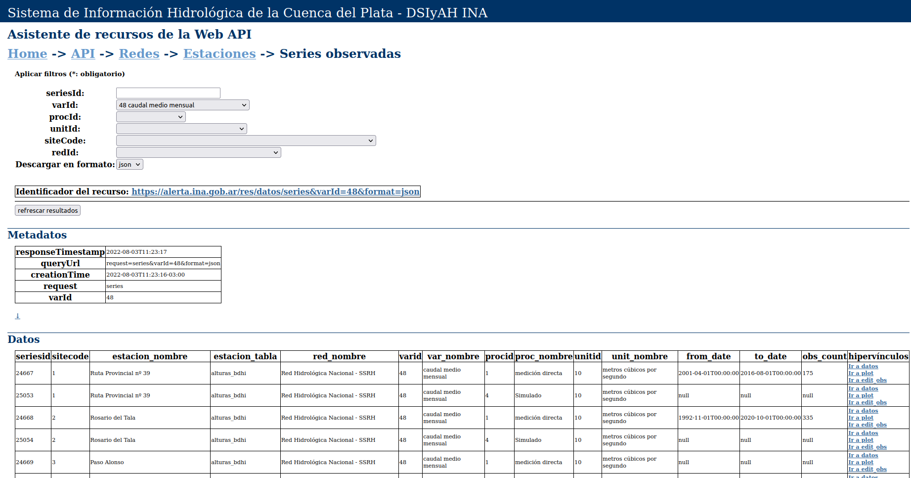

# INA SSIyAH
## Acceso a los servicios web de datos  
La Subgerencia de Sistemas de Información y Alerta Hidrológico del Instituto Nacional del Agua ofrece a la comunidad una serie de servicios web de datos y productos de interés para el estudio, monitoreo y previsión hidrológica de la Cuenca del Plata, tanto para usuarios técnicos como para el público general. En esta página se presenta un listado de dichos servicios junto con una breve descripción y los vínculos de acceso correspondiente. 

    
Aplicación web de datos hidrológicos (RESTful API)

    
        Esta aplicación ofrece listados de estaciones, listados de áreas de interés hídrico, series temporales de variables numéricas (p. ej: altura hidrómétrica, caudal o precipitación) series temporales de capas ráster de variables del ciclo hidrológico (incluyendo la posibilidad de agregar temporal y espacialmente), tanto observadas como simuladas, históricas y a tiempo real, de la Cuenca del Plata. Los formatos disponibles son CSV, XML, JSON y GeoJSON para datos vectoriales o GTIFF y PNG para datos ráster. Los pedidos se realizan mediante HTTP-GET colocando los parámetros en la cadena de consulta (query string). El Asistente de la Aplicación ayuda al usuario a construir la URL requerida, a la vez que permite visualizar los resultados en forma de tabla, gráfico o imagen.

- URL base de la aplicación (sin parámetros devuelve la descripción de la aplicación en formato JSON) https://alerta.ina.gob.ar/pub/datos/
- Asistente de la Aplicación https://alerta.ina.gob.ar/pub/gui/

  
Catálogo y visualizador de Información Hidrológica

    Es una herramienta de acceso rápido a la información hidrológica de la Cuenca del Plata disponible a tiempo real que puede resultar útil para el monitoreo de amenazas hidroclimáticas e hidrológicas tales como sequías e inundaciones.
    Sobre la base de un mapa navegable se pueden desplegar capas geográficas vinculadas a variables claves del ciclo hidrológico, tales como la precipitación, la humedad del suelo, el nivel hidrométrico y el caudal, tanto observadas in situ como estimadas remotamente o simuladas mediante modelos matemáticos. Además de poder visualizar el mapa y los gráficos y tablas que se despliegan al cliquear sobre los objetos del mapa, el usuario puede obtener los puntos de acceso a los Servicios Web, lo cual le permite consumir en forma interoperable la información publicada. La información se obtiene de fuentes externas o bien es elaborada por el SIyAH. Por tratarse de un servicio a tiempo real, los datos no se encuentran consistidos ni validados, por lo tanto el Instituto no se hace responsable por la calidad de los mismos. Los usuarios pueden comunicarse via email (alerta@ina.gob.ar) o teléfono (+54 11 4480 4500 int. 2341) para obtener datos validados. El instructivo de uso puede consultarse aquí. El servicio web de mapas se provee mediante Geoserver.

- Mapa navegable https://alerta.ina.gob.ar/pub/mapa
- Servidor de mapas (Geoserver) https://alerta.ina.gob.ar/geoserver/web/
- Catálogo de metadatos https://alerta.ina.gob.ar/pub/gui/metadata

  
Repositorio de archivos abierto

    En una estructura de directorios se ofrece información georeferenciada en formatos ráster y vectorial y productos visuales tales como gráficos y mapas, correspondientes a productos de monitoreo y pronóstico de interés para las tareas de hidrología operativa de la Cuenca del Plata. Se puede acceder utilizando cualquier navegador de Internet, descubrir, descargar los productos y opcionalmente copiar los vínculos para realizar descargas programadas.

- [https://alerta.ina.gob.ar/ina](https://alerta.ina.gob.ar/ina)

  
Visualizador de datos - series puntuales

    Esta aplicación web ofrece el acceso, a través de un formulario de búsqueda, un mapa navegable y tablas filtrables, al conjunto de series temporales de observaciones y pronósticos operativos del Sistema de Información Hidrometeorológica de la Subgerencia. En la sección "ver datos" es posible visualizar y descargar las series temporales en diversos formatos, así como también sus metadatos. A su vez, en la sección de "catálogo" es posible explorar las tablas de términos utilizados en los registros de metadatos de las series temporales, incluyendo sus identificadores y definiciones. La aplicación es una de las componentes de un proyecto de desarrollo de código abierto: https://github.com/jbianchi81/alerta-hims  

- Ver datos [https://alerta.ina.gob.ar/a5/secciones](https://alerta.ina.gob.ar/a5/secciones)
- Catálogo [https://alerta.ina.gob.ar/a5/metadatos](https://alerta.ina.gob.ar/a5/metadatos)

  
a5 - JSON custom web API

    Este es un servicio web RESTful que ofrece datos y metadatos de series temporales del Sistema de Información Hidrometeorológica de la Subgerencia. Su objetivo es habilitar el acceso programático interoperable a los datos públicos del Sistema (los mismos que pueden consultarse manualmente a través del Visualizados de Datos). El formato JSON (https://json.org) es un estándar ampliamente difundido y de fácil implementación en los entornos de programación más utilizados actualmente.
    Las invocaciones se realizan mediante protocolo HTTPS. Puede descargarse el documento descriptivo de la aplicación según el estándar openapi-3.0.0. Además, la página "apiUI" ofrece una descripción de las funciones disponibles y de los formatos de intercambio y formularios para realizar invocaciones de prueba. La aplicación es una de las componentes de un proyecto de desarrollo de código abierto: https://github.com/jbianchi81/alerta-hims

- apiUI [https://alerta.ina.gob.ar/a5/apiUI](https://alerta.ina.gob.ar/a5/apiUI)
- documento openapi [https://alerta.ina.gob.ar/a5/json/apidocs.json](https://alerta.ina.gob.ar/a5/json/apidocs.json)

  
Servicio web WaterOneFlow 1.0 / WaterML 1.1

    Esta aplicación ofrece listados de estaciones, listados de variables observadas y series temporales de variables altura hidrométrica y caudal en formato WaterML 1.1. Utiliza el protocolo estándar WaterOneFlow (véase cuahsi.org). El Asistente de la Aplicación sirve como guía para la construcción de la URL de la invocación.

- Asistente de la aplicación [https://alerta.ina.gob.ar/wml/gui](https://alerta.ina.gob.ar/wml/gui)
- url base [https://alerta.ina.gob.ar/wml](https://alerta.ina.gob.ar/wml)

  
Servidor de mapas Geoserver

    Geoserver es una aplicación web de código abierto (geoserver.org) utilizada para publicar recursos geográficos a través de protocolos estándar (https://wiki.osgeo.org/wiki/Wms). A través de esta aplicación, ponemos a disposición diversas capas de información geográfica de tanto de tipo vectorial y como ráster, incluyendo capas dinámicas que se actualizan en forma permanente. Los usuarios programadores pueden utilizar este servicio para realizar la descarga programática de las capas de interés, así como también sumar dichas capas a sus aplicaciones geográficas de escritorio o en la web. 

- Geoserver [https://alerta.ina.gob.ar/geoserver](https://alerta.ina.gob.ar/wml/gui)
